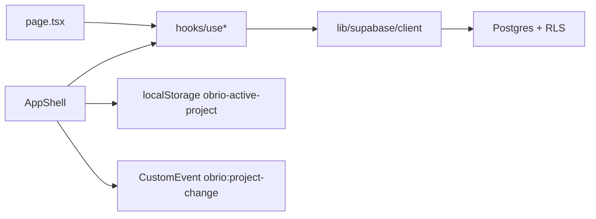
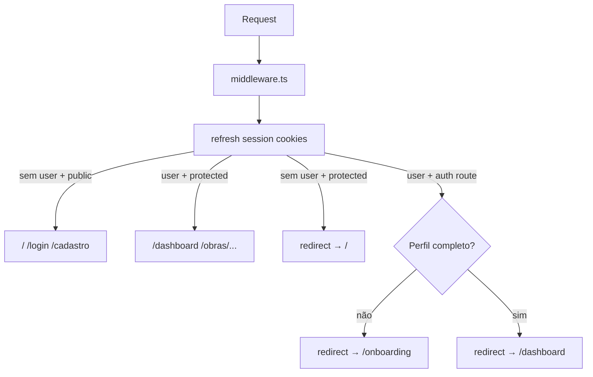

# Arquitetura — Obrio AI

## Stack

| Camada | Tecnologia | Versão (package.json) |
|--------|------------|----------------------|
| Framework | Next.js (App Router) | 15.5.x |
| UI | React | 18.3.x |
| Linguagem | TypeScript (strict) | 5.5.x |
| Estilo | Tailwind CSS | 3.4.x |
| Ícones | lucide-react | 0.468.x |
| Backend | Supabase | @supabase/ssr, @supabase/supabase-js |
| Deploy | Cloudflare Workers + OpenNext | @opennextjs/cloudflare, wrangler |
| Testes | Vitest + Playwright | vitest, @playwright/test |

## Estrutura de pastas

```
obrio-ai/
├── app/                    # Rotas App Router (20 páginas)
│   ├── layout.tsx          # Root layout (metadata, favicon)
│   ├── page.tsx            # Login (raiz)
│   ├── auth/signout/       # POST logout
│   ├── globals.css
│   └── */page.tsx
├── components/
│   ├── AppShell.tsx        # Shell autenticado
│   ├── Ui.tsx              # Primitivos de UI
│   ├── Brand.tsx
│   ├── ObrioMark.tsx       # Logo (fallback inline "OB")
│   └── WhatsAppIcon.tsx
├── hooks/                  # useAuth, useObras, useLembretes, etc.
├── lib/
│   └── supabase/
│       ├── client.ts
│       ├── server.ts
│       ├── middleware.ts
│       └── env.ts
├── e2e/                    # Playwright specs
├── supabase/
│   ├── config.toml
│   └── migrations/         # 001–009
├── public/
│   ├── favicon.svg
│   └── _headers            # Security + cache (Cloudflare)
├── middleware.ts           # Auth refresh + redirects
├── wrangler.jsonc          # Cloudflare Worker config
├── open-next.config.ts
├── playwright.config.ts
└── package.json
```

## Padrões de layout

### Páginas standalone (sem AppShell)

- `/` — auth unificado (Entrar + Criar conta quando habilitado)
- `/login` — alias do auth unificado
- `/cadastro` — redirect para `/?mode=cadastro`
- `/onboarding` — wizard de perfil pós-login (standalone)
- `/obras/nova` — wizard de nova obra (opcional, via dashboard/Obras)

### Páginas com AppShell

Todas as demais rotas autenticadas usam `AppShell` com props:

```tsx
<AppShell title="..." subtitle="..." action={/* opcional */}>
  {children}
</AppShell>
```

**AppShell** fornece:
- Sidebar desktop (286px) + nav mobile (pills horizontais)
- Seletor de obra ativa + modais (upgrade, arquivadas, gerenciar)
- Menu usuário (perfil, assinatura, logout via POST `/auth/signout`)
- Dock de input IA (`showObrioInput`) em 7 rotas
- FAB WhatsApp (`showWhatsAppButton`) em 8 rotas

## Gerenciamento de estado



| Mecanismo | Uso |
|-----------|-----|
| Hooks em `hooks/` | Dados Supabase por módulo (obras, lembretes, etc.) |
| `useState` | Formulários, filtros, modais locais |
| `useMemo` | Filtros e ordenação |
| `localStorage` | ID da obra ativa (`obrio-active-project`) |
| `CustomEvent` | Notificar dashboard ao trocar obra |

## Fluxo de auth



Pós-login (login form, callback, middleware): perfil incompleto → `/onboarding`; perfil completo → `/dashboard`. Cadastro de obra em `/obras/nova` é opcional.

## Decisões arquiteturais

| Decisão | Escolha | Racional |
|---------|---------|----------|
| Router | App Router | Padrão Next.js 15 |
| Client vs Server | Predominantemente `"use client"` | Interatividade; hooks no client |
| UI library | Hand-rolled (`Ui.tsx`) | Controle total, sem shadcn |
| Auth | Supabase Auth + middleware | Cookies SSR, RLS |
| Multi-obra | `useObraAtiva` + `localStorage` | Seletor no AppShell |
| Dados | Client hooks + RLS | Páginas não chamam Supabase direto |
| Deploy | Cloudflare + OpenNext | Edge, domínio obrioai.app |
| i18n | PT-BR hardcoded | Mercado único inicial |

## Pontos de atenção

1. **AppShell grande** — extrair `ProjectSelector` quando crescer.
2. **Rotas legadas** — `/recibos`, `/clima`, `/assistente` redirecionam; `/equipe` → `/responsaveis`.
3. **Assinatura** — limites via `subscriptions`; compra na Hotmart; billing in-app após núcleo pronto.
4. **E2E** — auth flow coberto; expandir para obra/lembrete.

## Referências

- [DATA-MODEL.md](./DATA-MODEL.md)
- [SECURITY.md](./SECURITY.md)
- [INTEGRATIONS.md](./INTEGRATIONS.md)
- [DEVELOPMENT.md](./DEVELOPMENT.md)
- [DEPLOYMENT.md](./DEPLOYMENT.md)
