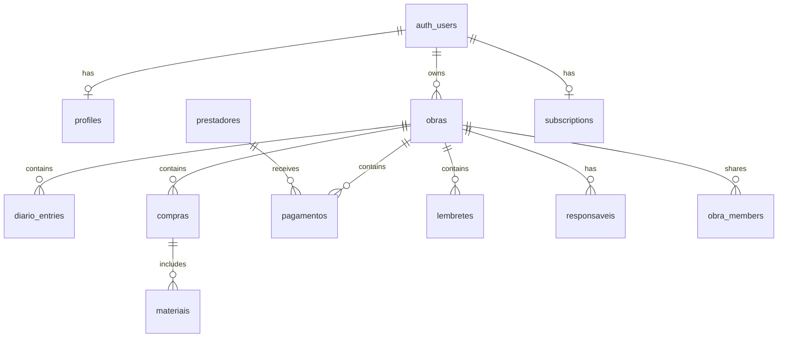

# Modelo de Dados — Obrio AI

Schema Supabase existente, entidades inferidas da UI e proposta alvo.

## Schema existente (migrations 001–009)

Arquivo base: `supabase/migrations/001_obrio_core.sql`  
Extensões: `002_obras_extend.sql` … `008_obra_members.sql`, `009_signup_invites.sql`

### `profiles`

Extensão de `auth.users`.

| Coluna | Tipo | Notas |
|--------|------|-------|
| id | uuid PK | FK → auth.users |
| full_name | text | |
| whatsapp | text | |
| avatar_path | text | migration 007 — path no bucket `avatars` |
| notification_prefs | jsonb | migration 007 |
| created_at | timestamptz | default now() |
| updated_at | timestamptz | default now() |

**RLS:** select/update/insert own (`auth.uid() = id`)

**Trigger:** `handle_new_user()` cria profile ao signup.

### `obras`

Projetos de construção/reforma.

| Coluna | Tipo | Notas |
|--------|------|-------|
| id | uuid PK | gen_random_uuid() |
| owner_id | uuid FK | auth.users |
| name | text NOT NULL | |
| type | text | check: 'Obra completa', 'Reforma' |
| status | text | 'Ativa', 'Pausada', 'Concluída', 'Arquivada' |
| city, state, address | text | |
| budget_cents | bigint | default 0 |
| spent_cents | bigint | default 0 |
| progress | smallint | 0–100 |
| start_date, delivery_date | date | |
| responsible | text | Nome do responsável |
| property_type | text | migration 002 |
| area_sqm | numeric | migration 002 |
| goals | text[] | migration 002 |
| created_at, updated_at | timestamptz | |

**RLS:** all own (`auth.uid() = owner_id`)

---

## Tabelas core (migrations 003–008)

| Migration | Tabelas | Storage |
|-----------|---------|---------|
| 003 | `lembretes`, `responsaveis` | — |
| 004 | `diario_entries` | `diario-fotos` |
| 005 | `compras`, `materiais` (+ trigger `spent_cents`) | `notas-fiscais` |
| 006 | `prestadores`, `pagamentos` | `comprovantes` |
| 007 | `subscriptions`, extensão `profiles` | `avatars` |
| 008 | `obra_members` (futuro `/equipe`) | — |
| 009 | `signup_invites` (cadastro pós-compra Hotmart) | — |

### `signup_invites` (009)

Convites de cadastro gerados pelo webhook Hotmart.

| Coluna | Tipo | Notas |
|--------|------|-------|
| id | uuid PK | |
| email | text | |
| token_hash | text | hash do token do link |
| hotmart_transaction_id | text unique | idempotência |
| buyer_name, buyer_phone | text | opcional |
| plan | text | gratuito, mensal, premium |
| consumed_at, revoked_at | timestamptz | |
| expires_at | timestamptz | default +30 dias |

**RLS:** sem policies — acesso apenas via service role (webhook/signup API).

RLS padrão para filhas de obra: join com `obras.owner_id = auth.uid()`.

Hooks correspondentes em `hooks/`: `useLembretes`, `useResponsaveis`, `useDiario`, `useMateriais`, `usePagamentos`, `useProfile`, `useSubscription`.

---

## Entidades inferidas da UI (legado — substituídas)

### Diário (`diario_entries`)

Campos vistos em `app/diario/page.tsx`:

| Campo UI | Coluna sugerida |
|----------|-----------------|
| obra | obra_id uuid FK |
| data | entry_date date |
| autor | author_name text |
| texto | content text |
| tags | tags text[] |
| anexos | attachment_urls text[] ou Storage refs |
| clima | weather_note text |

### Materiais / Compras

| Entidade | Campos principais |
|----------|-------------------|
| `compras` | obra_id, date, supplier, total_cents, nf_url |
| `materiais` | compra_id, name, category, qty, unit, warranty_until |
| `garantias` | material_id, expires_at, alert_sent |

### Mão de obra

| Entidade | Campos principais |
|----------|-------------------|
| `prestadores` | obra_id, name, role, phone |
| `pagamentos` | obra_id, prestador_id, amount_cents, date, status, receipt_url |

### Lembretes

| Campo UI | Coluna sugerida |
|----------|-----------------|
| título | title text |
| data/hora | due_at timestamptz |
| obra | obra_id uuid |
| status | status enum (pendente, concluído, adiado) |
| canal | channel enum (app, whatsapp) |

### Responsáveis (`/responsaveis`)

| Campo UI | Coluna sugerida |
|----------|-----------------|
| nome, email, telefone | name, email, phone |
| obra | obra_id uuid |
| função | role text |
| status | status enum |

### Equipe (`/equipe`)

| Campo UI | Coluna sugerida |
|----------|-----------------|
| colaborador | user_id ou invite_email |
| obra | obra_id uuid |
| permissões | permissions jsonb |

### Assinatura

| Entidade | Campos |
|----------|--------|
| `subscriptions` | user_id, plan, status, `stripe_customer_id` (legado/reservado → renomear `hotmart_subscriber_id` na fase billing), current_period_end |

### Recibos

| Entidade | Campos |
|----------|--------|
| `recibos` | obra_id, payer, payee, amount_cents, description, issued_at, pdf_url |

---

## Schema alvo (proposta)



### Convenções

- Valores monetários em **centavos** (`bigint`) — evita float
- Timestamps em **timestamptz** (UTC)
- Toda tabela de domínio: `obra_id` + RLS via join com `obras.owner_id`
- Soft delete opcional: `deleted_at` (Fase 2+)

### Padrão RLS para tabelas filhas

```sql
create policy "obra_child_all_own" on public.diario_entries
  for all using (
    exists (
      select 1 from public.obras
      where obras.id = diario_entries.obra_id
        and obras.owner_id = auth.uid()
    )
  );
```

---

## Mapeamento UI → DB (atual)

| UI | Fonte de dados |
|----|----------------|
| Seletor obra ativa | `localStorage` + `useObraAtiva` |
| Métricas dashboard | hooks agregados por `obra_id` |
| Limites de plano | `subscriptions` via `useSubscription` |
| Captura (+ Registrar) | hooks `create*` → Supabase |

### Normalização de status

| UI (exibição) | DB |
|-----------|-----|
| Em andamento | Ativa |
| Pausada | Pausada |
| Concluída | Concluída |
| Arquivada | Arquivada |

---

## Migrations futuras (naming)

```
supabase/migrations/
├── 001_obrio_core.sql          # existente
├── 002_diario_materiais.sql    # proposta
├── 003_pagamentos_lembretes.sql
├── 004_responsaveis_equipe.sql
└── 005_subscriptions.sql
```

---

## Storage (Supabase)

Buckets sugeridos:

| Bucket | Conteúdo | RLS |
|--------|----------|-----|
| `diario-fotos` | Fotos do diário | path: `{user_id}/{obra_id}/...` |
| `notas-fiscais` | PDFs/imagens NF | idem |
| `comprovantes` | Recibos pagamentos | idem |
| `avatars` | Fotos de perfil | `{user_id}/avatar` |

---

## Referências

- `supabase/migrations/001_obrio_core.sql`
- [INTEGRATIONS.md](./INTEGRATIONS.md)
- [SECURITY.md](./SECURITY.md)
- Skill: `.cursor/skills/obrio-supabase/SKILL.md`
