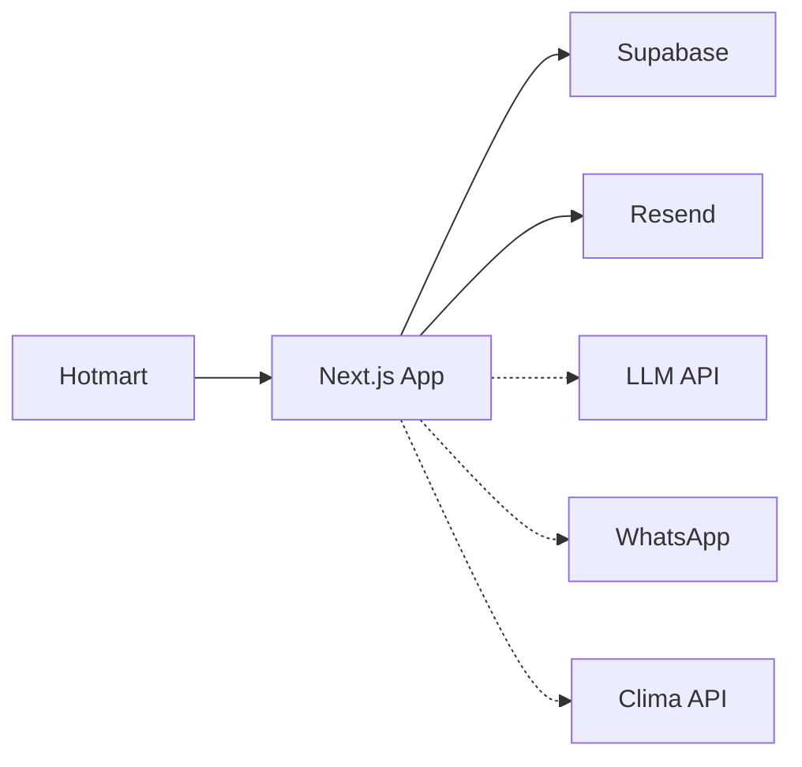

# Integrações — Obrio AI

Integrações externas: estado atual, arquitetura e pontos de entrada no código.

## Visão geral



| Integração | Estado | Prioridade |
|------------|--------|------------|
| Supabase Auth + DB | **Integrado** | P0 ✅ |
| Hotmart (pós-compra) | **Integrado** | P0 ✅ |
| Resend (email boas-vindas) | **Integrado** | P0 ✅ |
| Supabase Storage | **Integrado** (avatars, diário) | P1 ✅ |
| Assistente IA | Dock UI only | P1 |
| WhatsApp | FAB → config, copy only | P2 |
| Clima | API Open-Meteo no dashboard | P2 |
| Hotmart billing (sync plano) | **Pendente** — após núcleo do produto | P4 |

---

## Supabase ✅

### Auth

**Implementado:** `components/auth/AuthScreen.tsx` em `/` e `/login`, redirect `/cadastro`, `middleware.ts`, `app/auth/signout/route.ts`

| Fluxo pós-compra | Implementação |
|------------------|---------------|
| Compra Hotmart | `POST /api/webhooks/hotmart` |
| Email boas-vindas | Resend → link `/?mode=cadastro&email&token` |
| Cadastro | `POST /api/auth/signup` (email + senha + WhatsApp, sem OTP) |
| Pós-cadastro | Aba Entrar na mesma tela (sem auto-login) |
| Login | `signInWithPassword` → onboarding de perfil ou `/dashboard` |

Login: `signInWithPassword` → `/onboarding` (perfil incompleto) ou `/dashboard`.

Logout: POST `/auth/signout` → redirect `/`.

### Client setup

```
lib/supabase/
├── client.ts    # createBrowserClient
├── server.ts    # createServerClient + cookies
├── middleware.ts
└── env.ts       # URL + ANON_KEY ou PUBLISHABLE_KEY
```

Variáveis: `NEXT_PUBLIC_SUPABASE_URL`, `NEXT_PUBLIC_SUPABASE_ANON_KEY` (ou `NEXT_PUBLIC_SUPABASE_PUBLISHABLE_KEY`)

### Database

Migrations `001`–`008` em `supabase/migrations/` — aplicadas no remoto.

Tabelas principais: `profiles`, `obras`, `lembretes`, `responsaveis`, `diario_entries`, `compras`, `materiais`, `prestadores`, `pagamentos`, `subscriptions`.

Ver [DATA-MODEL.md](./DATA-MODEL.md).

### Storage

| Módulo | Bucket / uso |
|--------|--------------|
| Perfil | `avatars` — upload avatar |
| Diário | Fotos de obra (paths por user/obra) |

Buckets com RLS por owner.

### Realtime (opcional)

Subscriptions em lembretes ou colaboração — Fase 3+.

---

## Assistente IA (parcial)

### UI atual

- Dock global em `AppShell.tsx` — **oculto por padrão** (`NEXT_PUBLIC_AI_DOCK_ENABLED=false`)
- Página `/assistente` → redirect `/dashboard`
- `POST /api/ai/chat` — resposta stub ou OpenAI se `OPENAI_API_KEY`

### Arquitetura alvo

```
Browser → POST /api/ai/chat → LLM provider
                ↓
         Context: obra_id, módulo, histórico
                ↓
         Persistência parseada (compras, pagamentos, etc.)
```

---

## WhatsApp (pendente)

### UI atual

- FAB **oculto por padrão** (`NEXT_PUBLIC_WHATSAPP_FAB_ENABLED=false`)
- Quando ativo: link externo via `NEXT_PUBLIC_WHATSAPP_URL`
- Campo WhatsApp em perfil e onboarding

### Arquitetura alvo

Lembretes diários, alertas clima via WhatsApp Business API.

---

## Clima (integrado no dashboard)

### UI atual

- `ObraWeatherCard` no `/dashboard` — cidade da obra ativa
- `GET /api/weather` — Open-Meteo (geocoding + previsão 7 dias)
- `/clima` → redirect `/dashboard`

---

## Hotmart + Resend ✅

### Fluxo pós-compra

```
Hotmart PURCHASE_COMPLETE → POST /api/webhooks/hotmart
  → signup_invites + token
  → Resend (purchase-welcome)
  → link https://obrioai.app/?mode=cadastro&email&token
Usuário cadastra → POST /api/auth/signup → aba Entrar → login
```

### Arquivos

| Arquivo | Função |
|---------|--------|
| `app/api/webhooks/hotmart/route.ts` | Webhook |
| `app/api/auth/signup/route.ts` | Cadastro server-side |
| `lib/hotmart/parse-event.ts` | Parser payload |
| `lib/email/send-purchase-welcome.ts` | Envio Resend |
| `scripts/create-test-invite.ts` | Invite manual (`--send-email` testa Resend) |

### Configuração Hotmart

1. Ferramentas → Webhook → URL `https://obrioai.app/api/webhooks/hotmart`
2. Eventos: Compra aprovada, Compra completa
3. Copiar Hottok → secret `HOTMART_HOTTOK`

### Configuração Resend

1. Verificar domínio `obrioai.app` (SPF/DKIM)
2. `RESEND_API_KEY` + `EMAIL_FROM`

---

## Pagamentos / Assinatura (parcial)

### UI atual

- `/assinatura` — planos Gratuito, Mensal, Premium (read-only via `useSubscription`)
- Link externo para `NEXT_PUBLIC_SALES_PAGE_URL` (Hotmart)
- Limites via tabela `subscriptions` + hook `useSubscription`

### Pendente (fase pós-sistema)

Monetização via Hotmart; integração de plano pós-compra será implementada após finalização do núcleo do produto:

```
Webhook Hotmart → atualiza subscriptions.plan após signup
Portal Hotmart → upgrade / cancelamento pelo comprador
/assinatura → espelho read-only + link para página de vendas
```

---

## Export PDF / Excel (parcial)

### UI atual

- `/relatorios` — export `.txt` via `POST /api/export/report`
- Excel desabilitado (em breve)
- `/recibos` → redirect `/dashboard`

---

## Referências

- [DATA-MODEL.md](./DATA-MODEL.md)
- [SECURITY.md](./SECURITY.md)
- [DEPLOYMENT.md](./DEPLOYMENT.md)
- `.env.example`
