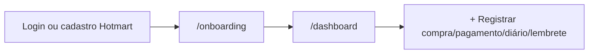

# Visão de Produto — Obrio AI

## Problema

Donos de obras, reformas e pequenos empreiteiros gerenciam informações críticas (gastos, pagamentos, fotos, prazos, garantias) em planilhas, WhatsApp e papel. Isso gera perda de controle financeiro, atrasos e dificuldade para gerar relatórios confiáveis.

## Proposta de valor

**Obrio AI** centraliza a gestão da obra em um único lugar, com captura rápida de dados e lembretes proativos — inclusive via WhatsApp (planejado).

> *"Seu assistente inteligente de obras e reformas."* — metadata em `app/layout.tsx`

## Personas

| Persona | Necessidade principal |
|---------|----------------------|
| **Dono da obra** | Visão financeira, prazos, status e relatórios para decisão |
| **Responsável técnico / mestre de obras** | Diário de obra, registro de compras e pagamentos da equipe |
| **Comprador Hotmart** | Entrada rápida pós-compra (email → cadastro → onboarding) |

## Módulos do produto

| Módulo | Rota | Descrição |
|--------|------|-----------|
| Landing / Auth | `/`, `/login` → `/` | Login + cadastro pós-compra (flag) |
| Onboarding perfil | `/onboarding` | Nome, WhatsApp, foto opcional pós-login |
| Dashboard | `/dashboard` | Hub: métricas reais, clima da obra, timeline |
| Obras | `/obras`, `/obras/nova` | Lista, filtros, wizard de nova obra |
| Diário da obra | `/diario` | Timeline + **criar entrada** |
| Materiais | `/materiais` | Compras + **registrar compra** |
| Mão de obra | `/mao-de-obra` | Pagamentos + **registrar pagamento** |
| Responsáveis | `/responsaveis` | CRUD (`/trocar-obra` → redirect 301) |
| Lembretes | `/lembretes` | CRUD + **criar lembrete** |
| Relatórios | `/relatorios` | KPIs reais da obra ativa; export `.txt` |
| Perfil | `/perfil` | Conta, avatar, plano |
| Assinatura | `/assinatura` | Plano read-only + link Hotmart |
| Configurações | `/configuracoes` | Toggles (sem persistência ainda) |
| Financeiro | `/financeiro` | Visão agregada (rota órfã) |

Redirects legados: `/clima`, `/recibos`, `/assistente` → `/dashboard`; `/equipe` → `/responsaveis`.

## Fluxos principais

### 1. Aquisição e entrada (Hotmart)

Compra Hotmart → webhook → email Resend → link cadastro → `POST /api/auth/signup` → onboarding → dashboard.

### 2. Onboarding de obra

Wizard de 11 passos em `/obras/nova`: nome, tipo, localização, orçamento, metas, datas.

### 3. Operação diária

- **+ Registrar** em Diário, Compras, Pagamentos e Lembretes (formulários persistidos no Supabase)
- Seletor de obra ativa no AppShell
- Dashboard com totais e timeline reais

### 4. Fechamento / relatório

Relatórios com KPIs da obra ativa; export textual (`.txt`). Excel e PDF avançados — pendente.

## Planos e limites

Tabela `subscriptions` + `PLAN_LIMITS` em `lib/types/database.ts`:

| Plano | Obras | Responsáveis/obra |
|-------|-------|-------------------|
| Gratuito | 1 | 1 |
| Mensal | 5 | 5 |
| Premium | 10 | 10 |

- **Compra:** apenas via Hotmart (`NEXT_PUBLIC_SALES_PAGE_URL`)
- **`/assinatura`:** espelho read-only do plano; upgrade/cancelamento in-app **após conclusão do núcleo**
- Sync automático Hotmart → `subscriptions.plan` — **fase pós-sistema**

## Estado atual vs. visão

| Capacidade | Estado atual |
|------------|--------------|
| UI + nav enxuto | ✅ |
| Dados persistentes (núcleo) | ✅ Supabase + RLS |
| Auth + onboarding | ✅ |
| Captura CRUD (4 módulos) | ✅ |
| Relatórios reais | ✅ (export `.txt`) |
| Clima por cidade da obra | ✅ Open-Meteo |
| Hotmart + Resend | ✅ código; secrets prod pendentes |
| Assistente IA | Stub (`/api/ai/chat`; dock off por default) |
| WhatsApp API | Pendente |
| Billing Hotmart → plano | Pendente (pós-sistema) |

Ver [ROADMAP.md](./ROADMAP.md) para fases de evolução.

## Referências

- [ROUTES.md](./ROUTES.md) — detalhe por rota
- [ARCHITECTURE.md](./ARCHITECTURE.md) — stack e camadas
- [DATA-MODEL.md](./DATA-MODEL.md) — entidades de dados
- [INTEGRATIONS.md](./INTEGRATIONS.md) — Hotmart, Resend, APIs
