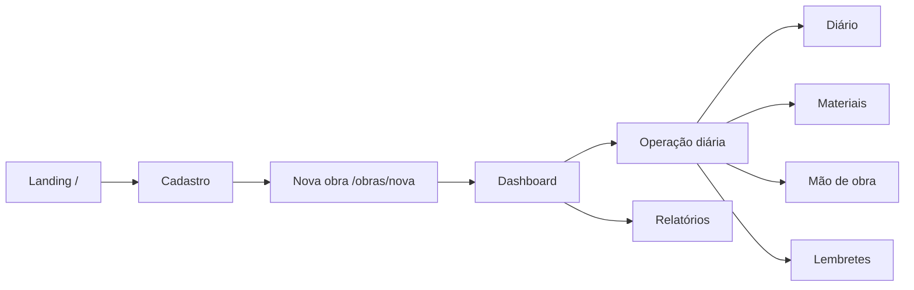

# Visão de Produto — Obrio AI

## Problema

Donos de obras, reformas e pequenos empreiteiros gerenciam informações críticas (gastos, pagamentos, fotos, prazos, garantias) em planilhas, WhatsApp e papel. Isso gera perda de controle financeiro, atrasos e dificuldade para gerar relatórios confiáveis.

## Proposta de valor

**Obrio AI** centraliza a gestão da obra em um único lugar, com assistente inteligente para captura rápida de dados (texto, foto, áudio) e lembretes proativos — inclusive via WhatsApp.

> *"Seu assistente inteligente de obras e reformas."* — metadata em `app/layout.tsx`

## Personas

| Persona | Necessidade principal |
|---------|----------------------|
| **Dono da obra** | Visão financeira, prazos, status e relatórios para decisão |
| **Responsável técnico / mestre de obras** | Diário de obra, registro de compras e pagamentos da equipe |
| **Colaborador convidado** | Acesso limitado à obra (módulo equipe — planejado) |

## Módulos do produto

| Módulo | Rota | Descrição |
|--------|------|-----------|
| Landing | `/` | Marketing, CTAs para cadastro e login |
| Autenticação | `/login`, `/cadastro` | Entrada e onboarding de conta |
| Dashboard | `/dashboard` | Hub: resumo do dia, métricas, clima, timeline |
| Obras | `/obras`, `/obras/nova` | Lista, filtros, wizard de nova obra |
| Diário da obra | `/diario` | Linha do tempo com anexos e filtros |
| Materiais | `/materiais` | Compras, NF, garantias, gráficos |
| Mão de obra | `/mao-de-obra` | Pagamentos a prestadores, alertas |
| Responsáveis | `/trocar-obra` | CRUD de responsável por obra |
| Lembretes | `/lembretes` | Agenda com CRUD local funcional |
| Relatórios | `/relatorios` | Análise IA, gráficos, export (stub) |
| Assistente | `/assistente` | Landing do assistente + dock global |
| Perfil | `/perfil` | Conta, avatar, notificações, senha |
| Assinatura | `/assinatura` | Planos e limites |
| Configurações | `/configuracoes` | Notificações, WhatsApp |
| Financeiro | `/financeiro` | Despesas manuais (rota órfã) |
| Recibos | `/recibos` | Gerador de recibos (rota órfã) |
| Clima | `/clima` | Previsão 7 dias (rota órfã) |
| Equipe | `/equipe` | Colaboradores (rota órfã, overlap com responsáveis) |

## Fluxos principais

### 1. Aquisição
Landing → Cadastro (5 passos: email, código, senha, WhatsApp, sucesso) → Dashboard ou Nova obra.

### 2. Onboarding de obra
Wizard de 11 passos em `/obras/nova`: nome, tipo, localização, orçamento, metas, datas, etc. Modo manual ou IA (UI parcial).

### 3. Operação diária
- Registrar no diário (fotos, texto)
- Lançar compras e pagamentos (SmartCaptureBox + dock IA)
- Gerenciar lembretes
- Trocar obra ativa via AppShell

### 4. Fechamento / relatório
Relatórios com filtros de período, export PDF/Excel (stub), análise IA (stub).

## Planos e limites

Hardcoded em `components/AppShell.tsx` (`planRules`):

| Plano | Limite de obras | Responsáveis por obra |
|-------|-----------------|----------------------|
| Gratuito | (UI em `/assinatura`) | — |
| Mensal | (UI em `/assinatura`) | — |
| **Premium** (demo) | 10 | 1 |

A página `/assinatura` exibe comparação visual dos planos; pagamento ainda é stub.

## Estado atual vs. visão

| Capacidade | MVP atual | Produção alvo |
|------------|-----------|---------------|
| UI completa | Sim | Sim |
| Dados persistentes | Não (mocks) | Supabase |
| Auth real | Não | Supabase Auth |
| IA funcional | Não (dock UI) | API + LLM |
| WhatsApp | FAB → config | API Business |
| Export PDF/Excel | Stub | Geração server-side |

Ver [ROADMAP.md](./ROADMAP.md) para fases de evolução.

## Referências

- [ROUTES.md](./ROUTES.md) — detalhe por rota
- [ARCHITECTURE.md](./ARCHITECTURE.md) — stack e camadas
- [DATA-MODEL.md](./DATA-MODEL.md) — entidades de dados
